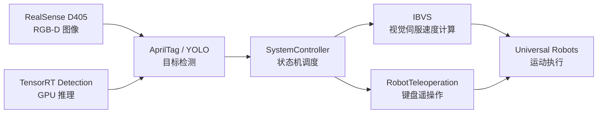

# IBVS Teleoperation UR

> 基于视觉伺服的 Universal Robots 遥操作系统。项目集成 RealSense D405、AprilTag、ViSP、OpenCV、TensorRT/YOLO，实现从视觉感知到机器人运动控制的实时闭环。

## Highlights

- 实现基于 AprilTag 的 Eye-in-Hand 图像视觉伺服控制，用于机器人目标对准与跟踪。
- 支持 Universal Robots 机械臂键盘遥操作，包含位姿控制、关节控制、精细/快速模式和急停逻辑。
- 集成 RealSense D405 RGB-D 相机采集，并通过 ViSP 完成相机接口与视觉伺服计算。
- 封装 TensorRT YOLO 推理模块，在 CUDA/TensorRT 可用时支持 GPU 加速目标检测。
- 使用 C++17、CMake、ViSP、OpenCV、Eigen 构建模块化机器人控制系统。
- 提供独立 YOLO 测试程序，支持相机、图片和视频输入，便于验证检测效果与性能。

## Tech Stack

`C++17` / `CMake` / `ViSP` / `OpenCV` / `Eigen` / `RealSense SDK` /
`CUDA` / `TensorRT` / `YOLO` / `Universal Robots`

## Demo

当前仓库暂未包含演示图片或视频素材。建议将运行截图、机械臂运动 GIF、YOLO 检测 GIF
放入 `assets/` 目录，并在本节展示：

```markdown
| 视觉伺服 | 遥操作 | 目标检测 |
| --- | --- | --- |
|  |  |  |
```

也可以添加完整视频链接：

```markdown
[查看完整演示视频](assets/demo.mp4)
```

## System Overview



核心闭环：

```text
RealSense 图像采集 -> AprilTag/YOLO 检测 -> IBVS 控制计算 -> UR 机器人执行
```

## My Contributions

- 设计并实现 `SystemController` 状态机，协调视觉伺服、遥操作、目标检测和硬件接口。
- 实现基于 AprilTag 的 IBVS 控制流程，完成图像误差计算、控制律执行和机器人速度发送。
- 封装 `RobotTeleoperation` 键盘控制模块，支持位姿控制、关节控制、精细/快速控制和急停。
- 集成 TensorRT YOLO 推理模块，实现目标检测结果解析与可视化。
- 编写独立 YOLO 测试程序，支持相机、图片、视频三类输入源和性能统计。
- 将机器人 IP、AprilTag、相机分辨率、控制步长、安全位姿等参数集中到 `AppConfig`。

## Core Features

- **视觉伺服控制（IBVS）**：基于 AprilTag 的图像视觉伺服与目标跟踪。
- **机器人遥操作**：通过键盘控制机器人平移、旋转、关节运动和急停。
- **YOLO 目标检测**：在 CUDA/TensorRT 可用时启用 GPU 加速检测。
- **RealSense 相机接口**：通过 ViSP `vpRealSense2` 获取 RGB/深度数据。
- **模块化控制器**：由 `SystemController` 协调视觉伺服、遥操作、检测和硬件接口。

## Hardware

- Universal Robots 系列机器人（如 UR5、UR10、UR12e 等）
- Intel RealSense D405 相机
- NVIDIA GPU（可选，用于 TensorRT/YOLO 加速）

## Project Structure

```text
.
├── CMakeLists.txt
├── include/
│   ├── AppConfig.h
│   ├── RobotTeleoperation.h
│   ├── SystemController.h
│   └── TensorRT_detection.h
├── src/
│   ├── main.cpp
│   ├── RobotTeleoperation.cpp
│   ├── SystemController.cpp
│   └── TensorRT_detection.cpp
├── models/
│   └── model_fp16.engine
├── test/
│   ├── CMakeLists.txt
│   ├── TEST_INSTRUCTIONS.md
│   ├── run_test.sh
│   └── test_yolo_detector.cpp
└── else/
```

## Dependencies

### Required

- CMake 3.10+
- C++17 兼容编译器
- ViSP 3.7.1+
- OpenCV
- Eigen3
- RealSense SDK（通常通过 ViSP 的传感器组件使用）

Ubuntu/Debian 常用依赖安装示例：

```bash
sudo apt-get install libopencv-dev libeigen3-dev librealsense2-dev
```

ViSP 可从源码构建：

```bash
git clone https://github.com/lagadic/visp.git
cd visp
mkdir build && cd build
cmake .. -DBUILD_DEMOS=OFF -DBUILD_EXAMPLES=OFF
make -j$(nproc)
sudo make install
```

### Optional

- CUDA：用于 GPU 加速。
- TensorRT：用于 YOLO 推理。可通过 `TENSORRT_DIR` 指定安装路径；未设置时，
  CMake 会尝试 `$HOME/TensorRT-8.6`。

当前 `CMakeLists.txt` 中设置了 `VISP_DIR`：

```cmake
set(VISP_DIR "/home/kun/visp-ws/visp-build")
```

如果本机 ViSP 安装路径不同，请先在 `CMakeLists.txt` 中调整该路径，或改为适合本机
环境的查找方式。

## Build

```bash
mkdir -p build
cd build
cmake ..
make -j$(nproc)
```

生成的主程序为：

```bash
./IBVS_Teleoperation
```

## Run

1. 连接 Universal Robots 机器人，并确认机器人处于可远程控制状态。
2. 连接 RealSense D405 相机。
3. 根据本机网络和标定结果检查 `include/AppConfig.h` 中的机器人 IP、相机参数和外参。
4. 启动程序：

```bash
cd build
./IBVS_Teleoperation
```

系统启动后默认进入视觉伺服流程，并可切换到遥操作流程。

### Teleoperation Keys

- **W/X**：X 方向平移
- **A/D**：Y 方向平移
- **R/F**：Z 方向平移
- **I/K**：绕 X 轴旋转
- **J/L**：绕 Y 轴旋转
- **U/O**：绕 Z 轴旋转
- **1-6**：对应关节正向运动
- **Shift+1-6**：对应关节反向运动（终端输入为 `!@#$%^`）
- **S**：停止当前位姿/关节命令
- **Z**：快速/精细模式切换
- **Space**：急停/解除急停
- **Q**：退出

具体按键行为以 `src/RobotTeleoperation.cpp` 当前实现为准。

## YOLO Detection

YOLO 检测依赖 TensorRT。启用步骤：

1. 准备 `.engine` 或 `.trt` 格式的 TensorRT 模型文件。
2. 在配置或初始化逻辑中设置模型路径，例如使用 `models/model_fp16.engine`。
3. 确认 CUDA、TensorRT 库和头文件可被 CMake 找到。
4. 重新编译并运行主程序。

检测结果会绘制在相机图像上，并在控制台输出检测状态和性能信息。

## Test YOLO Detector

测试程序位于 `test/`，用于验证 YOLO 检测器，可使用相机、图片或视频作为输入。

构建测试：

```bash
mkdir -p build/test
cd build/test
cmake ../../test
make -j$(nproc)
```

运行脚本：

```bash
cd test
./run_test.sh camera <model_path>
./run_test.sh image <model_path> <image>
./run_test.sh video <model_path> <video>
```

也可以直接运行测试可执行文件：

```bash
./test_yolo_detector --model <model_path> --source camera --stats
```

常用参数包括：

- `--model, -m <路径>`：YOLO 模型路径
- `--source, -s <类型>`：输入源，支持 `camera`、`image`、`video`
- `--input, -i <路径>`：输入图片或视频路径
- `--confidence, -c <值>`：置信度阈值
- `--nms, -n <值>`：NMS 阈值
- `--save, -S`：保存检测结果
- `--output, -o <路径>`：输出目录
- `--stats, -t`：显示性能统计
- `--width, -w <值>`：相机宽度
- `--height, -h <值>`：相机高度

## Configuration

主要配置集中在 `include/AppConfig.h` 的 `AppConfig` 结构体中：

| 配置项 | 默认值 | 说明 |
| --- | --- | --- |
| `robot_ip` | `192.168.31.100` | 机器人 IP |
| `tag_size` | `0.03` | AprilTag 标签尺寸，单位米 |
| `tag_quad_decimate` | `2` | AprilTag 检测降采样因子 |
| `display_tag` | `true` | 是否显示检测到的标签 |
| `camera_width` | `1280` | 相机图像宽度 |
| `camera_height` | `720` | 相机图像高度 |
| `convergence_threshold` | `0.00005` | 视觉伺服收敛阈值 |
| `desired_loop_time_ms` | `20.0` | 期望控制循环周期 |
| `force_z_threshold` | `-15.0` | Z 方向力阈值 |
| `fine_linear_step` | `0.005` | 精细平移步长 |
| `coarse_linear_step` | `0.015` | 快速平移步长 |
| `fine_angular_step` | `0.025` | 精细旋转步长 |
| `coarse_angular_step` | `0.120` | 快速旋转步长 |
| `fine_joint_step` | `0.005` | 精细关节步长 |
| `coarse_joint_step` | `0.010` | 快速关节步长 |
| `adaptive_gain` | `false` | 是否启用自适应增益 |
| `task_sequencing` | `false` | 是否启用任务序列化 |
| `verbose` | `false` | 是否输出详细调试信息 |
| `plot` | `false` | 是否实时绘图 |

`AppConfig` 还包含相机外参 `ePc` 和安全关节位姿 `safe_joint_position`，部署前应根据
实际标定与机器人工作空间检查这些值。

## Detailed Architecture

```text
┌──────────────────────────────────────────────────────────────────────────────┐
│                                  系统控制器                                  │
│                                                                              │
│  ┌─────────────┐  ┌─────────────┐  ┌─────────────┐  ┌─────────────┐          │
│  │  视觉伺服   │  │  遥操作     │  │ YOLO 检测   │  │  相机接口   │          │
│  │  控制模块   │  │  控制模块   │  │  控制模块   │  │  控制模块   │          │
│  └─────────────┘  └─────────────┘  └─────────────┘  └─────────────┘          │
└──────────────────────────────────────────────────────────────────────────────┘
                                    │
                                    ▼
┌──────────────────────────────────────────────────────────────────────────────┐
│                               底层硬件接口                                   │
│                                                                              │
│  ┌─────────────┐  ┌─────────────┐  ┌─────────────┐  ┌─────────────┐          │
│  │ Universal   │  │ RealSense   │  │ CUDA 加速   │  │ TensorRT    │          │
│  │ Robots      │  │ D405        │  │             │  │ 推理引擎    │          │
│  └─────────────┘  └─────────────┘  └─────────────┘  └─────────────┘          │
└──────────────────────────────────────────────────────────────────────────────┘
```

### Core Modules

- **SystemController**：协调各模块工作，负责状态管理和任务调度。实现文件：
  `src/SystemController.cpp`。
- **视觉伺服控制（IBVS）**：基于 AprilTag 进行目标追踪，计算视觉误差并发送机器人速度。
  相关逻辑位于 `SystemController` 的视觉伺服处理流程中。
- **RobotTeleoperation**：解析键盘输入，生成平移、旋转、关节控制和急停指令。实现文件：
  `src/RobotTeleoperation.cpp`。
- **TensorRT_detection**：封装 TensorRT 推理、检测结果解析与可视化。实现文件：
  `src/TensorRT_detection.cpp`。
- **相机接口**：通过 ViSP `vpRealSense2` 获取 RealSense D405 的图像和深度数据。

### State Machine

系统控制器使用状态机组织任务流程：

- `STATE_IBVS`：视觉伺服状态
- `STATE_WAIT_SELECT`：等待选择状态
- `STATE_APPROACH`：接近目标状态
- `STATE_TELEOP`：遥操作状态

### Data Flow

视觉伺服：

```text
相机图像 -> AprilTag 目标检测 -> 视觉伺服速度计算 -> 机器人执行运动
```

遥操作：

```text
键盘输入 -> 遥操作指令解析 -> 速度/关节控制 -> 机器人执行运动
```

YOLO 检测：

```text
RGB 图像 -> 图像预处理 -> TensorRT 模型推理 -> 检测结果绘制
```

## Troubleshooting

程序运行时会在控制台输出初始化、检测、控制和错误信息。常见问题如下：

| 问题 | 可能原因 | 处理建议 |
| --- | --- | --- |
| 相机连接失败 | 相机未连接、驱动或 RealSense SDK 异常 | 检查连接、驱动和 SDK，重新插拔相机 |
| 机器人连接失败 | IP 错误、网络异常、机器人未进入远程模式 | 检查 `robot_ip`、网络和机器人控制模式 |
| TensorRT 未找到 | 未安装 TensorRT 或路径未配置 | 设置 `TENSORRT_DIR`，检查库文件和头文件路径 |
| YOLO 检测不工作 | 模型路径错误或 GPU/CUDA 配置异常 | 检查模型文件、CUDA、TensorRT 和 GPU 支持 |
| 视觉伺服不稳定 | 增益、相机固定、标定或 AprilTag 可见性问题 | 调整参数，固定相机，重新标定并保证标签清晰 |

## Extension Points

- 扩展 `TensorRT_detection`，接入新的目标检测算法或类别。
- 替换 `vpRealSense2` 实例以支持其他相机。
- 替换 `vpRobotUniversalRobots` 实例以支持其他机器人。
- 在 `SystemController` 中添加路径规划、碰撞检测、多机器人协同或图形化界面。

## Safety Notes

- 初次运行必须在安全、空旷、可急停的环境中测试。
- 启动前检查机器人 IP、工作空间、安全位姿、相机外参和控制步长。
- 操作前确认急停按键和实体急停设备可用。
- 定期校准相机与机器人外参。
- 建议在实际部署中加入额外的工作空间限制和碰撞检测。

## Future Work

- 增加 GUI 控制界面，展示相机图像、检测框、状态机状态和机器人状态。
- 添加碰撞检测和工作空间约束。
- 接入路径规划模块，实现更复杂的任务级控制。
- 补充真实实验 GIF/视频和性能数据，增强简历展示效果。

## Document Source

本 README 合并并重写了 `SYSTEM_ARCHITECTURE.md` 与 `USER_GUIDE.md` 的内容，同时根据
当前 `CMakeLists.txt`、`include/AppConfig.h`、`src/RobotTeleoperation.cpp` 和测试文档
更新了构建、配置、按键与测试说明。
