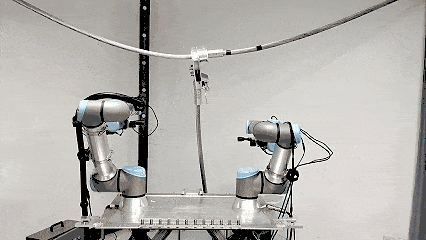
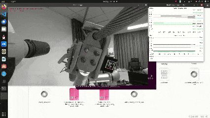
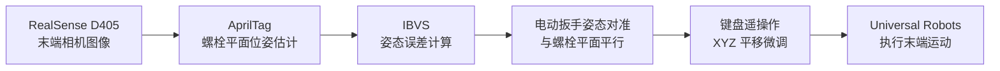

# 基于 IBVS 的螺栓拆卸系统

> 面向螺栓作业的 Universal Robots 视觉伺服与遥操作系统。项目通过 RealSense D405 识别螺栓平面上的 AprilTag，使用 IBVS 调整机械臂末端电动扳手姿态，使电动扳手与螺栓平面平行；对准后通过键盘控制电动扳手在 XYZ 方向移动，实现靠近、定位和作业前微调。

<div align="center">
  
  
</div>

## 说明

左侧为全局视角，右侧为 UR12e 末端 D405 相机视角。演示重点是机械臂在 AprilTag 视觉反馈下调整电动扳手姿态，使其与螺栓平面平行，并在对准后通过键盘完成 XYZ 方向微调。

## 项目亮点

- 实现基于 AprilTag 的 Eye-in-Hand IBVS 控制，用于让末端电动扳手与螺栓平面自动对准。
- 将任务拆分为两阶段：IBVS 姿态对准，收敛后键盘控制电动扳手 XYZ 平移。
- 支持 Universal Robots 机械臂键盘遥操作，包含精细/快速步长、急停和速度发送开关。
- 集成 RealSense D405 RGB-D 相机采集，并通过 ViSP 完成 AprilTag 检测、位姿估计和视觉伺服计算。
- 完成 YOLO 螺栓识别实验，可识别螺栓平面上的四个螺栓位置；同时保留 TensorRT 推理模块和独立测试程序。
- 使用 C++17、CMake、ViSP、OpenCV、Eigen 构建模块化机器人控制系统。

## 技术栈

`C++17` / `CMake` / `ViSP` / `OpenCV` / `Eigen` / `RealSense SDK` /
`AprilTag` / `Universal Robots`/ `TensorRT` / `YOLO`


## 系统流程



核心闭环：

```text
RealSense 图像采集 -> AprilTag 螺栓平面位姿估计 -> IBVS 姿态对准 -> 键盘 XYZ 平移微调
```

## 主要工作

- 设计并实现 `SystemController` 状态机，协调 AprilTag 检测、IBVS 对准、键盘遥操作和机器人控制。
- 实现基于 AprilTag 的 IBVS 对准流程，使机械臂末端电动扳手自动调整到与螺栓平面平行。
- 实现收敛后的混合控制逻辑：IBVS 保持姿态，键盘控制末端电动扳手沿 X/Y/Z 平移。
- 封装 `RobotTeleoperation` 键盘控制模块，支持精细/快速步长、急停和退出控制。
- 完成 YOLO 螺栓识别测试，可在图像中定位四个螺栓位置，并保留 TensorRT 推理接口和独立测试程序。
- 将机器人 IP、AprilTag、相机分辨率、控制步长、安全位姿等参数集中到 `AppConfig`。

## 核心功能

- **视觉伺服控制（IBVS）**：基于 AprilTag 识别螺栓平面，并调整电动扳手末端姿态。
- **键盘 XYZ 遥操作**：在姿态对准后，通过键盘控制电动扳手上下、左右、前后移动。
- **YOLO 螺栓识别扩展**：已完成四螺栓位置识别测试，仓库包含 TensorRT 检测模块和测试程序。
- **RealSense 相机接口**：通过 ViSP `vpRealSense2` 获取 RGB/深度数据。
- **模块化控制器**：由 `SystemController` 协调视觉伺服、遥操作、检测和硬件接口。

## 硬件组成

- Universal Robots 系列机器人（如 UR5、UR10、UR12e 等）
- 机械臂末端电动扳手执行器
- 带 AprilTag 标记的螺栓平面或螺栓作业工装
- Intel RealSense D405 相机
- NVIDIA GPU（可选，用于 TensorRT/YOLO 加速）

## 项目结构

```text
.
├── CMakeLists.txt
├── include/
│   ├── AppConfig.h
│   ├── RobotTeleoperation.h
│   ├── SystemController.h
│   └── TensorRT_detection.h
├── src/
│   ├── main.cpp
│   ├── RobotTeleoperation.cpp
│   ├── SystemController.cpp
│   └── TensorRT_detection.cpp
├── models/
│   └── model_fp16.engine
├── test/
│   ├── CMakeLists.txt
│   ├── TEST_INSTRUCTIONS.md
│   ├── run_test.sh
│   └── test_yolo_detector.cpp
└── archive/
```

## 环境依赖

### 必需依赖

- CMake 3.10+
- C++17 兼容编译器
- ViSP 3.7.1+
- OpenCV
- Eigen3
- RealSense SDK（通常通过 ViSP 的传感器组件使用）

Ubuntu/Debian 常用依赖安装示例：

```bash
sudo apt-get install libopencv-dev libeigen3-dev librealsense2-dev
```

ViSP 可从源码构建：

```bash
git clone https://github.com/lagadic/visp.git
cd visp
mkdir build && cd build
cmake .. -DBUILD_DEMOS=OFF -DBUILD_EXAMPLES=OFF
make -j$(nproc)
sudo make install
```

### 可选依赖

- CUDA：用于 GPU 加速。
- TensorRT：用于 YOLO 推理。可通过 `TENSORRT_DIR` 指定安装路径；未设置时，
  CMake 会尝试 `$HOME/TensorRT-8.6`。

当前 `CMakeLists.txt` 中设置了 `VISP_DIR`：

```cmake
set(VISP_DIR "/home/kun/visp-ws/visp-build")
```

如果本机 ViSP 安装路径不同，请先在 `CMakeLists.txt` 中调整该路径，或改为适合本机
环境的查找方式。

## 编译

```bash
mkdir -p build
cd build
cmake ..
make -j$(nproc)
```

生成的主程序为：

```bash
./IBVS_Teleoperation
```

## 运行

1. 将电动扳手安装到机械臂末端，并确认工具坐标系、相机外参和工作空间安全。
2. 在螺栓平面或作业工装上布置 AprilTag，确保相机能稳定看到标签。
3. 连接 Universal Robots 机器人，并确认机器人处于可远程控制状态。
4. 连接 RealSense D405 相机。
5. 根据本机网络和标定结果检查 `include/AppConfig.h` 中的机器人 IP、AprilTag 尺寸、相机参数和外参。
6. 启动程序：

```bash
cd build
./IBVS_Teleoperation
```

系统启动后先执行 IBVS 姿态对准；当视觉误差连续收敛后，进入键盘 XYZ 平移微调阶段。

### 键盘控制

- **W/X**：电动扳手沿 X 方向前后移动
- **A/D**：电动扳手沿 Y 方向左右移动
- **R/F**：电动扳手沿 Z 方向上下移动
- **I/K**：绕 X 轴旋转
- **J/L**：绕 Y 轴旋转
- **U/O**：绕 Z 轴旋转
- **1-6**：对应关节正向运动
- **Shift+1-6**：对应关节反向运动（终端输入为 `!@#$%^`）
- **S**：停止当前位姿/关节命令
- **Z**：快速/精细模式切换
- **Space**：急停/解除急停
- **Q**：退出

本项目主要使用 `W/X`、`A/D`、`R/F` 完成电动扳手 XYZ 微调。其他旋转和关节按键保留为调试能力，具体行为以 `src/RobotTeleoperation.cpp` 当前实现为准。

## 可选 YOLO/TensorRT 模块

仓库中包含 `TensorRT_detection` 封装和 YOLO 测试程序。目前项目主线聚焦 AprilTag 视觉伺服对准螺栓平面；同时，YOLO 螺栓识别部分已完成基础验证，可正常识别螺栓平面上的四个螺栓位置。

<div align="center">
  
</div>

启用 YOLO/TensorRT 需要：

1. 准备 `.engine` 或 `.trt` 格式的 TensorRT 模型文件。
2. 在配置或初始化逻辑中设置模型路径，例如使用 `models/model_fp16.engine`。
3. 确认 CUDA、TensorRT 库和头文件可被 CMake 找到。
4. 重新编译并运行主程序。

如果没有配置模型路径，主流程会使用 AprilTag 检测完成视觉伺服。

## YOLO 检测测试程序

测试程序位于 `test/`，用于验证 YOLO 检测器，可使用相机、图片或视频作为输入。

构建测试：

```bash
mkdir -p build/test
cd build/test
cmake ../../test
make -j$(nproc)
```

运行脚本：

```bash
cd test
./run_test.sh camera <model_path>
./run_test.sh image <model_path> <image>
./run_test.sh video <model_path> <video>
```

也可以直接运行测试可执行文件：

```bash
./test_yolo_detector --model <model_path> --source camera --stats
```

常用参数包括：

- `--model, -m <路径>`：YOLO 模型路径
- `--source, -s <类型>`：输入源，支持 `camera`、`image`、`video`
- `--input, -i <路径>`：输入图片或视频路径
- `--confidence, -c <值>`：置信度阈值
- `--nms, -n <值>`：NMS 阈值
- `--save, -S`：保存检测结果
- `--output, -o <路径>`：输出目录
- `--stats, -t`：显示性能统计
- `--width, -w <值>`：相机宽度
- `--height, -h <值>`：相机高度

## 系统配置

主要配置集中在 `include/AppConfig.h` 的 `AppConfig` 结构体中：

| 配置项 | 默认值 | 说明 |
| --- | --- | --- |
| `robot_ip` | `192.168.31.100` | 机器人 IP |
| `tag_size` | `0.03` | AprilTag 标签尺寸，单位米 |
| `tag_quad_decimate` | `2` | AprilTag 检测降采样因子 |
| `display_tag` | `true` | 是否显示检测到的标签 |
| `camera_width` | `1280` | 相机图像宽度 |
| `camera_height` | `720` | 相机图像高度 |
| `convergence_threshold` | `0.00005` | 视觉伺服收敛阈值 |
| `desired_loop_time_ms` | `20.0` | 期望控制循环周期 |
| `force_z_threshold` | `-15.0` | Z 方向力阈值 |
| `fine_linear_step` | `0.005` | 精细平移步长 |
| `coarse_linear_step` | `0.015` | 快速平移步长 |
| `fine_angular_step` | `0.025` | 精细旋转步长 |
| `coarse_angular_step` | `0.120` | 快速旋转步长 |
| `fine_joint_step` | `0.005` | 精细关节步长 |
| `coarse_joint_step` | `0.010` | 快速关节步长 |
| `adaptive_gain` | `false` | 是否启用自适应增益 |
| `task_sequencing` | `false` | 是否启用任务序列化 |
| `verbose` | `false` | 是否输出详细调试信息 |
| `plot` | `false` | 是否实时绘图 |

`AppConfig` 还包含相机外参 `ePc` 和安全关节位姿 `safe_joint_position`，部署前应根据
实际标定与机器人工作空间检查这些值。

## 详细架构

```text
┌──────────────────────────────────────────────────────────────────────────────┐
│                                  系统控制器                                  │
│                                                                              │
│  ┌─────────────┐  ┌─────────────┐  ┌─────────────┐  ┌─────────────┐          │
│  │  姿态对准   │  │ XYZ 微调    │  │ AprilTag    │  │  相机接口   │          │
│  │  IBVS模块   │  │  遥操作模块 │  │ 平面估计模块 │  │  控制模块   │          │
│  └─────────────┘  └─────────────┘  └─────────────┘  └─────────────┘          │
└──────────────────────────────────────────────────────────────────────────────┘
                                    │
                                    ▼
┌──────────────────────────────────────────────────────────────────────────────┐
│                               底层硬件接口                                   │
│                                                                              │
│  ┌─────────────┐  ┌─────────────┐  ┌─────────────┐  ┌─────────────┐          │
│  │ Universal   │  │ RealSense   │  │ ViSP        │  │ OpenCV      │          │
│  │ Robots      │  │ D405        │  │ 视觉伺服    │  │ 图像处理    │          │
│  └─────────────┘  └─────────────┘  └─────────────┘  └─────────────┘          │
└──────────────────────────────────────────────────────────────────────────────┘
```

### 核心模块

- **SystemController**：协调 AprilTag 检测、IBVS 对准、键盘微调和速度发送。实现文件：
  `src/SystemController.cpp`。
- **视觉伺服控制（IBVS）**：基于 AprilTag 估计螺栓平面相对相机的位姿，计算视觉误差，
  发送机器人速度，使电动扳手末端姿态与螺栓平面平行。
- **RobotTeleoperation**：解析键盘输入，在 IBVS 收敛后生成 X/Y/Z 平移微调和急停指令。实现文件：
  `src/RobotTeleoperation.cpp`。
- **TensorRT_detection（可选）**：封装 TensorRT 推理、检测结果解析与可视化。实现文件：
  `src/TensorRT_detection.cpp`。当前主要演示不依赖该模块。
- **相机接口**：通过 ViSP `vpRealSense2` 获取 RealSense D405 的图像和深度数据。

### 状态机

系统控制器使用状态机组织任务流程：

- `STATE_IBVS`：视觉伺服对准状态，用于让电动扳手与螺栓平面平行
- `STATE_WAIT_SELECT`：等待选择状态
- `STATE_APPROACH`：接近目标状态
- `STATE_TELEOP`：遥操作状态，用于对准后的 XYZ 平移微调

### 数据流

姿态对准：

```text
相机图像 -> AprilTag 螺栓平面位姿估计 -> IBVS 姿态误差计算 -> 电动扳手对准螺栓平面
```

XYZ 微调：

```text
键盘输入 -> XYZ 平移指令解析 -> 机械臂末端速度控制 -> 电动扳手靠近/移动到目标螺栓
```

可选 YOLO/TensorRT 检测：

```text
RGB 图像 -> 图像预处理 -> TensorRT 模型推理 -> 检测结果绘制
```

## 常见问题

程序运行时会在控制台输出初始化、检测、控制和错误信息。常见问题如下：

| 问题 | 可能原因 | 处理建议 |
| --- | --- | --- |
| 相机连接失败 | 相机未连接、驱动或 RealSense SDK 异常 | 检查连接、驱动和 SDK，重新插拔相机 |
| 机器人连接失败 | IP 错误、网络异常、机器人未进入远程模式 | 检查 `robot_ip`、网络和机器人控制模式 |
| TensorRT 未找到 | 未安装 TensorRT 或路径未配置 | 设置 `TENSORRT_DIR`，检查库文件和头文件路径 |
| YOLO/TensorRT 扩展不工作 | 模型路径错误或 GPU/CUDA 配置异常 | 检查模型文件、CUDA、TensorRT 和 GPU 支持；主流程可继续使用 AprilTag |
| 电动扳手对准不稳定 | 增益、相机固定、标定或 AprilTag 可见性问题 | 调整 IBVS 参数，固定相机，重新标定并保证标签清晰 |

## 扩展方向

- 扩展 `TensorRT_detection`，接入新的目标检测算法或类别。
- 替换 `vpRealSense2` 实例以支持其他相机。
- 替换 `vpRobotUniversalRobots` 实例以支持其他机器人。
- 在 `SystemController` 中添加路径规划、碰撞检测、多机器人协同或图形化界面。

## 安全注意事项

- 初次运行必须在安全、空旷、可急停的环境中测试。
- 启动前检查机器人 IP、工作空间、安全位姿、相机外参和控制步长。
- 操作前确认急停按键和实体急停设备可用。
- 定期校准相机与机器人外参。
- 建议在实际部署中加入额外的工作空间限制和碰撞检测。

## 后续优化

- 添加碰撞检测和工作空间约束。
- 接入路径规划模块，实现更复杂的任务级控制。